# Développer des apps windows "the easy way" avec C#

### Introduction

Ce workshop a pour but de vous apprendre à développer des applications Windows en utilisant le langage C Sharp (et non "C hashtag") et le framework .NET. Nous allons voir comment créer une application Windows simple, comment ajouter des contrôles à cette application, gérer des événements, et comment déployer cette application.

Pour ce workshop, nous allons développer un dashboard simple qui affiche des informations sur la météo. Nous allons utiliser l'API OpenWeatherMap pour récupérer les données météo, et les afficher dans notre application.

### Prérequis

Pour suivre ce workshop, vous aurez besoin de :

- Visual Studio 2019 ou plus récent, Community Edition suffit. Je vais utiliser la version 2022 pour les démonstrations.
- Connaissances de base en langages orientés objet, encore mieux si vous avez des connaissances en C# (ou Java).
- Un ordinateur sous Windows 10 ou plus récent.

> Note : Nous allons également avoir besoin d'une clé API qui peut mettre quelques dizaines de minutes à être activée. Si vous n'avez pas de clé API, vous pouvez vous rendre sur [le site d'OpenWeatherMap](https://openweathermap.org/) pour créer un compte et en obtenir une gratuitement.

### Plan

1. Introduction à C# et .NET
2. Configuration de Visual Studio
3. Création d'une application Windows
4. Ajout de contrôles
5. Gestion des événements
6. Appel d'une API
7. Affichage des données
8. Déploiement de l'application

## Introduction à C# et .NET

C# est un langage de programmation orienté objet développé par Microsoft. Il est principalement utilisé pour le développement d'applications Windows, mais il peut également être utilisé pour développer des applications web (ASP.NET), des applications mobiles (.NET MAUI), des jeux (Unity), etc.

Le C# n'est pas un langage compilé directement en code machine, mais en code intermédiaire appelé CIL (Common Intermediate Language). Ce code intermédiaire est ensuite exécuté par la machine virtuelle .NET (CLR, Common Language Runtime). Cela rend le développement particulièrement facile, car vous n'avez pas à vous soucier de la gestion de la mémoire, qui est managée par le CLR et son Garbage Collector.

Ce langage est très similaire à Java dans sa syntaxe comme dans son fonctionnement, donc si vous avez des connaissances en Java, vous ne devriez pas avoir de difficultés à apprendre C#.

.NET est un framework développé par Microsoft qui fournit un environnement d'exécution pour les applications C#. Il fournit également une bibliothèque de classes qui permettent de développer des applications plus facilement.

## Configuration de Visual Studio

Afin de pouvoir développer des applications Windows en C#, vous aurez besoin de Visual Studio. Vous pouvez télécharger la version Community gratuitement sur le site de Microsoft.

> Note :  Si vous disposez déjà de Visual Studio, vous pouvez simplement lancer l'installeur pour modifier votre installation actuelle, et ajouter les composants nécessaires.

Une fois l'installeur téléchargé, il vous faudra sélectionner les composants à installer. Pour ce workshop, vous aurez besoin de l'option ".NET desktop development".

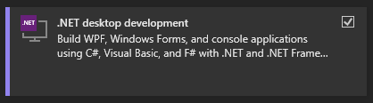

Cette option vous permettra d'installer les outils nécessaires pour développer des applications Windows en C#, ainsi que le SDK .NET.

## Création d'une application Windows

Pour créer une application Windows, vous pouvez utiliser un modèle fourni par Visual Studio. Pour cela, ouvrez Visual Studio et créez un nouveau projet.

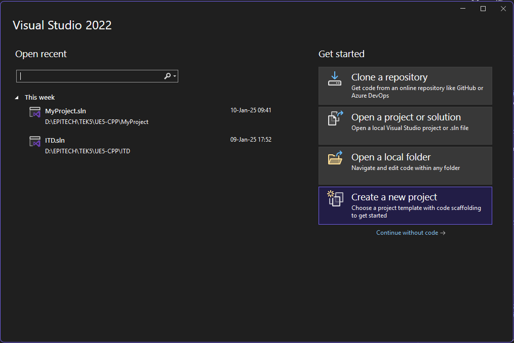

Il vous sera demandé de choisir un modèle de projet. Vous pouvez alors sélectionner "WPF Application" pour créer une application Windows avec WPF (Windows Presentation Foundation).

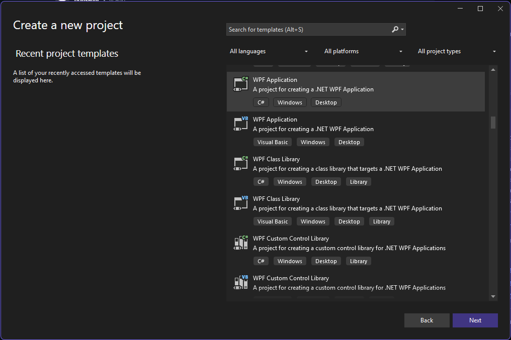

Donnez un nom à votre projet, et choisissez un emplacement pour enregistrer les fichiers. Vous pouvez également choisir le framework cible, qui sera .NET 8 par défaut.

Une fois le projet crée, vous allez être accueilli par une fenêtre de conception qui vous permet de visualiser votre application. Le modèle fourni par Visual Studio contient déjà une fenêtre principale, ainsi que des configurations permettant de lancer l'application.

Un simple clic sur le bouton "Start" (ou F5) vous permettra de lancer l'application et de la tester. Pour l'instant, l'application ne fait rien de particulier, mais nous allons voir comment ajouter des contrôles et du code pour la rendre plus intéressante.

Mais avant tout, nous allons voir comment est structuré un projet WPF.

### Structure d'un projet WPF

Un projet WPF est composé de plusieurs fichiers et dossiers :

- `App.xaml` et `App.xaml.cs` : ces fichiers contiennent la définition de l'application WPF, et permettent de configurer l'application.

- `MainWindow.xaml` et `MainWindow.xaml.cs` : ces fichiers contiennent la définition de la fenêtre principale de l'application. C'est ici que vous allez ajouter des contrôles et du code pour gérer les événements.

- `AssemblyInfo.cs` : ce fichier contient des informations sur l'assemblage, comme le nom, la version, etc.

## Ajout de contrôles

Premièrement, nous allons ajouter un champ de texte pour que l'utilisateur puisse entrer une ville. Pour cela, nous allons pouvoir ajouter une `TextBox` à notre fenêtre.

Dans le fichier `MainWindow.xaml`, vous pouvez ajouter le code suivant :

```xml
<Grid>
    <TextBox x:Name="TxtCity"
             Text="Bordeaux"
             HorizontalContentAlignment="Left"
             VerticalContentAlignment="Center"
             HorizontalAlignment="Left"
             Margin="10,10,0,0"
             VerticalAlignment="Top"
             Width="120"
             Height="30"/>
</Grid>
```

Ce code ajoute une `TextBox` à la fenêtre, avec un nom `TxtCity`, un texte par défaut "Bordeaux", et une taille de 120x30 pixels. Vous pouvez personnaliser les propriétés de la `TextBox` pour qu'elle corresponde à vos envies.

Ensuite, nous allons ajouter un bouton pour permettre à l'utilisateur de lancer la recherche de la météo. Vous pouvez ajouter le code suivant après la `TextBox` :

```xml
<Button x:Name="BtnSearch"
        Content="Search"
        HorizontalAlignment="Left"
        Margin="10,50,0,0"
        VerticalAlignment="Top"
        Width="120"
        Height="30"/>
```

Ce code ajoute un bouton à la fenêtre, avec un nom `BtnSearch`, un texte "Search", et une taille de 120x30 pixels. Vous pouvez également personnaliser les propriétés du bouton.

Si tout fonctionne correctement, vous devriez voir la `TextBox` et le bouton dans la fenêtre de conception de Visual Studio.

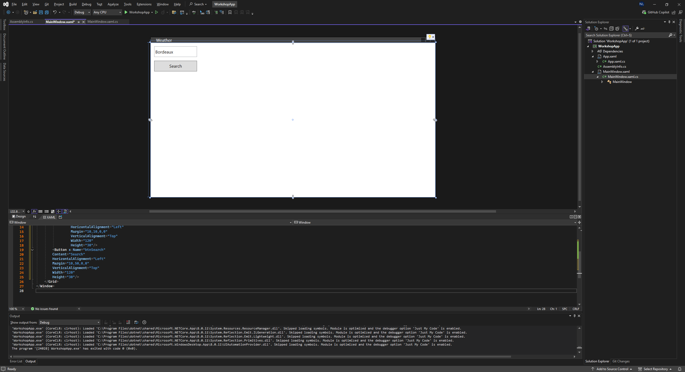

## Gestion des événements

Maintenant que nous avons ajouté des contrôles à notre fenêtre, nous allons voir comment gérer les événements. Dans notre cas, nous voulons que le bouton "Search" déclenche une action lorsque l'utilisateur clique dessus.

Pour cela, nous allons ajouter un gestionnaire d'événements dans le fichier `MainWindow.xaml.cs`. Ce fichier contient le code-behind de la fenêtre, c'est-à-dire le code qui gère les événements et les interactions avec les contrôles.

Dans ce gestionnaire d'évènements, nous voulons récupérer le texte de la `TextBox` et lancer une recherche de la météo pour cette ville. Voici le code à ajouter :

```csharp
private void BtnSearch_Click(object sender, RoutedEventArgs e)
{
    string city = TxtCity.Text;
    // Call the weather API
}
```

Il est également nécéssaire de transmettre l'information au bouton que le gestionnaire d'évènement est `BtnSearch_Click`. Pour cela, vous pouvez ajouter l'attribut `Click` au bouton dans le fichier `MainWindow.xaml` :

```xml
<Button x:Name="BtnSearch"
        Content="Search"
        HorizontalAlignment="Left"
        Margin="10,45,0,0"
        VerticalAlignment="Top"
        Width="120"
        Height="30"
        Click="BtnSearch_Click"/>
```

Comme vous pouvez le voir, les gestionnaires d'évènement sont extrèmement simples à mettre en place. Ici, nous récupérons le texte de la `TextBox` en utilisant la propriété `Text`, et nous stockons ce texte dans une variable `city`. Nous allons appeler une API météo pour voir si cette ville existe, et ensuite récupérer les données météo de cette ville.

## Appel d'une API

### Genéralités

Pour appeler une API, nous allons utiliser la classe `HttpClient` fournie par .NET. Cette classe permet de faire des requêtes HTTP vers des serveurs distants, et de récupérer les réponses.

Pour utiliser cette classe, vous devez ajouter une référence à `System.Net.Http` dans votre projet. Nous allons également avoir besoin de la classe `ConfigurationManager` pour récupérer la clé API stockée dans le fichier de configuration.

Pour cela, nous allons avoir besoin des librairies système suivantes :

```csharp
using System.Net.Http;
using System.Configuration;
```

### OpenWeatherMap

Nous allons également avoir besoin d'une clé API pour accéder à l'API OpenWeatherMap. Vous pouvez obtenir une clé API gratuite en vous inscrivant sur [le site d'OpenWeatherMap](https://openweathermap.org/). Cette clé nous permettra de faire des requêtes à l'API météo.

Vous pouvez la récupérer dans votre espace personnel, dans la section "API keys".

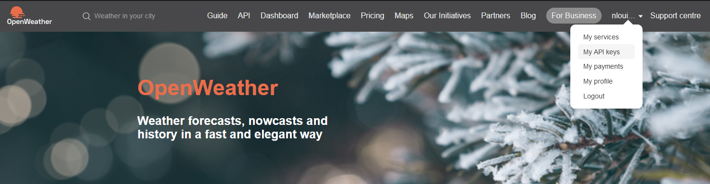

### Gestionnaire de configuration

Une fois la clé récupérée, nous allons la stocker dans un fichier de configuration. Pour cela, il vous faudra créer un fichier `App.config` à la racine de votre projet, et ajouter la clé API comme suit :

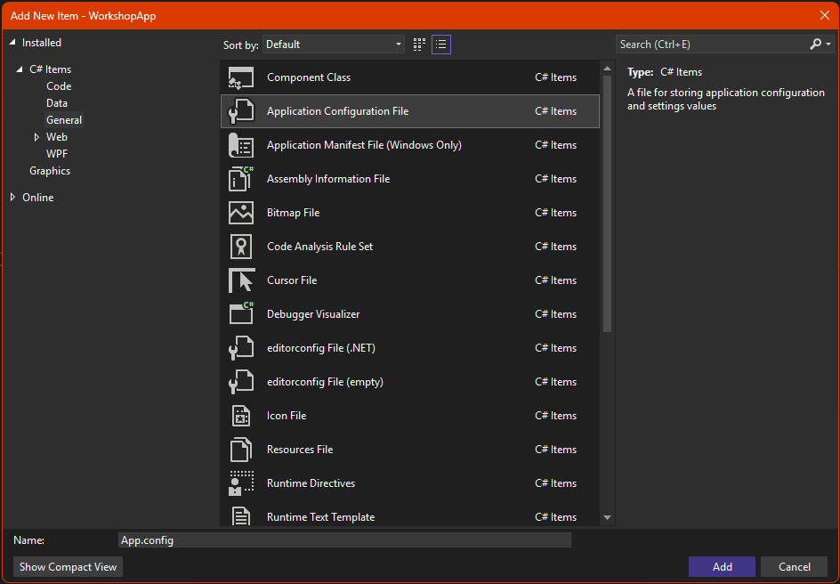

```xml
<?xml version="1.0" encoding="utf-8" ?>
<configuration>
	<appSettings>
		<add key="OpenWeatherMapApiKey" value="KEY"/>
	</appSettings>
</configuration>
```

Vous pouvez ensuite récupérer cette clé dans votre code en utilisant la classe `ConfigurationManager`. Voici comment vous pouvez récupérer la clé API dans votre code :

```csharp
string apiKey = ConfigurationManager.AppSettings["OpenWeatherMapApiKey"];
```

La solution la plus élégante serait de créer une classe `WeatherService` qui gère les appels à l'API météo. Cette classe pourrait contenir les méthodes pour récupérer les données météo, et les transformer en objets C#. Cela permet de séparer la logique de l'interface utilisateur, et de rendre le code plus lisible et maintenable (notemment dans le cas d'un changement d'API pour les données météo).

### Création du service météo

C'est donc ce que nous allons faire. Vous pouvez ajouter une nouvelle classe `WeatherService.cs` à votre projet (clic droit dans l'explorateur de solution, élément "Add" et ensuite "Class"), et y ajouter le code suivant :

```csharp
using System.Configuration;
using System.Net.Http;
using System.Text.Json;

namespace WorkshopApp
{
    internal struct WeatherData
    {
        public string City { get; set; }
        public string Description { get; set; }
        public double Temp { get; set; }
        public double FeelsLike { get; set; }
        public int Humidity { get; set; }
        public double WindSpeed { get; set; }
        public int WindDirection { get; set; }
    }

    internal class WeatherService
    {
        private readonly string ApiKey;
        private readonly HttpClient Client;
        private const string BaseWeatherUrl = "https://api.openweathermap.org/data/2.5/weather?lat={lat}&lon={lon}&appid={ApiKey}";
        private const string BaseGeoUrl = "http://api.openweathermap.org/geo/1.0/direct?q={cityName}&limit=1&appid={ApiKey}";

        public WeatherService()
        {
            ApiKey = ConfigurationManager.AppSettings["OpenWeatherMapApiKey"] ?? string.Empty;
            if (string.IsNullOrEmpty(ApiKey))
            {
                throw new Exception("OpenWeatherMap API key not found in App.config");
            }
            Client = new HttpClient();
        }
    }
}
```

Nous définissons ici une structure pour faciliter la manipulation des données météo, et une classe `WeatherService` qui va gérer les appels à l'API OpenWeatherMap. Nous initialisons la classe avec la clé API stockée dans le fichier de configuration, et nous créons une instance de `HttpClient` pour faire les requêtes HTTP.

Quelques variables statiques sont également définies, pour stocker les URLs de base des API OpenWeatherMap et rendre le code plus lisible.

A partir de cette base, nous allons pouvoir ajouter des méthodes pour récupérer les données météo, et les afficher dans notre application. Premièrement, il nous faut traduire le nom de la ville en coordonnées géographiques, pour pouvoir ensuite récupérer les données météo.

### Récupération des coordonnées géographiques

Pour récupérer les coordonnées géographiques d'une ville, nous allons utiliser l'API OpenWeatherMap Geo. Cette API permet de traduire le nom d'une ville en coordonnées géographiques (latitude et longitude). Par souci de simplicité, nous allons récupérer uniquement la première ville trouvée.

Voici le code à ajouter à la classe `WeatherService` :

```csharp
public (string, string) ValidateCity(string city)
{
    if (string.IsNullOrEmpty(city))
    {
        throw new Exception("Please enter a city name");
    }
    string requestUri = BaseGeoUrl.Replace("{cityName}", city).Replace("{ApiKey}", ApiKey);
    HttpResponseMessage response = Client.GetAsync(requestUri).Result;
    if (!response.IsSuccessStatusCode)
    {
        throw new Exception("City not found");
    }
    string content = response.Content.ReadAsStringAsync().Result;
    JsonDocument json = JsonDocument.Parse(content);
    double lat = json.RootElement[0].GetProperty("lat").GetDouble();
    double lon = json.RootElement[0].GetProperty("lon").GetDouble();
    string latStr = lat.ToString();
    string lonStr = lon.ToString();
    return (latStr, lonStr);
}
```

Cette méthode prend en paramètre le nom de la ville, et retourne les coordonnées géographiques de cette ville. Elle utilise l'API OpenWeatherMap Geo pour récupérer les coordonnées, et retourne une exception si la ville n'est pas trouvée. Cela nous permet de vérifier que la ville existe avant de récupérer les données météo.

### Récupération des données météo

Maintenant que nous avons les coordonnées géographiques de la ville, nous allons pouvoir récupérer les données météo. Pour cela, nous allons utiliser l'API OpenWeatherMap Weather. Cette API permet de récupérer les données météo d'une ville en fonction de ses coordonnées géographiques.

Nous allons utiliser les coordonnées géographiques pour construire l'URL de la requête, ainsi que notre structure pour faire transiter les données de façon claire et lisible.

```csharp
public WeatherData GetWeather(string city)
{
    if (string.IsNullOrEmpty(city))
    {
        throw new Exception("Please enter a city name");
    }
    (string lat, string lon) = ValidateCity(city);
    if (string.IsNullOrEmpty(lat) || string.IsNullOrEmpty(lon))
    {
        throw new Exception("Invalid city coordinates");
    }
    string requestUri = BaseWeatherUrl.Replace("{lat}", lat).Replace("{lon}", lon).Replace("{ApiKey}", ApiKey);
    HttpResponseMessage response = Client.GetAsync(requestUri).Result;
    if (!response.IsSuccessStatusCode)
    {
        throw new Exception("Weather data not found");
    }
    string content = response.Content.ReadAsStringAsync().Result;
    JsonDocument json = JsonDocument.Parse(content);
    JsonElement currentData = json.RootElement;
    JsonElement numericalData = currentData.GetProperty("main");
    JsonElement windData = currentData.GetProperty("wind");
    string desc = currentData.GetProperty("weather")[0].GetProperty("description").GetString() ?? "Description not found";
    double temp = numericalData.GetProperty("temp").GetDouble();
    double feelsLike = numericalData.GetProperty("feels_like").GetDouble();
    int humidity = numericalData.GetProperty("humidity").GetInt16();
    double windSpeed = windData.GetProperty("speed").GetDouble();
    int windDirection = windData.GetProperty("deg").GetInt32();
    WeatherData data = new()
    {
        City = city,
        Description = desc,
        Temp = temp,
        FeelsLike = feelsLike,
        Humidity = humidity,
        WindSpeed = windSpeed,
        WindDirection = windDirection
    };
    return data;
}
```

Cette méthode prend en paramètre le nom de la ville, et retourne un objet `WeatherData` contenant les données météo de cette ville. Elle utilise l'API OpenWeatherMap Weather pour récupérer les données météo, et retourne une exception si les données ne sont pas trouvées.

Ces méthodes sont utiles, car elles nous permettent d'interfacer notre application avec l'API météo de notre choix sans avoir à retoucher le code de l'interface utilisateur. Cela permet de séparer les préoccupations, et de rendre le code plus lisible et maintenable.

Il nous suffit donc maintenant de récupérer les données météo dans notre application, et de les afficher à l'utilisateur.

## Affichage des données

Pour afficher les données météo dans notre application, nous allons ajouter des contrôles à notre fenêtre. Nous allons ajouter des `TextBlock` pour afficher les différentes informations météo.

Si vous ne l'aviez pas encore remarqué, il est possible d'arranger les éléments dans la fenêtre de conception en utilisant le glisser-déposer. Vous pouvez également modifier les propriétés des contrôles directement dans le code XAML.

L'éditeur de code XAML de Visual Studio est très puissant, et vous permet de personnaliser les contrôles de façon très précise. Celui-ci proposera des règles et lignes pour vous permettre de créer une organisation propre. Tous les contrôles sont également accessibles via la "Toolbox", située à gauche de la fenêtre de conception.

Nous allons donc positionner quelques champs de données et icônes pour nous permettre d'afficher toutes les données météo que nous avons récupérées.

```xml
<Border BorderBrush="Black"
        BorderThickness="2"
        HorizontalAlignment="Left"
        VerticalAlignment="Top"
        Margin="135,10,10,10">
    <StackPanel x:Name="GridWeather"
          Width="450"
          Height="410">
        <TextBlock x:Name="TxtCityName"
                   Text="City"
                   HorizontalAlignment="Center"
                   Margin="10,10,0,0"
                   VerticalAlignment="Top"
                   FontSize="24"/>
        <TextBlock x:Name="TxtDescription"
                    Text="Description"
                    HorizontalAlignment="Center"
                    Margin="10,10,0,0"
                    VerticalAlignment="Top"
                    FontSize="24"/>
        <TextBlock x:Name="TxtTemperature"
                    Text="Temperature"
                    HorizontalAlignment="Center"
                    Margin="10,10,0,0"
                    VerticalAlignment="Top"
                    FontSize="24"/>
        <TextBlock x:Name="TxtFeelsLike"
                   Text="Feels Like"
                   HorizontalAlignment="Center"
                   Margin="10,10,0,0"
                   VerticalAlignment="Top"
                   FontSize="24"/>
        <TextBlock x:Name="TxtHumidity"
                    Text="Humidity"
                    HorizontalAlignment="Center"
                    Margin="10,10,0,0"
                    VerticalAlignment="Top"
                    FontSize="24"/>
        <TextBlock x:Name="TxtWind"
                    Text="Wind"
                    HorizontalAlignment="Center"
                    Margin="10,10,0,0"
                    VerticalAlignment="Top"
                    FontSize="24"/>
        <TextBlock x:Name="TxtWindDirection"
                    Text="Wind Direction"
                    HorizontalAlignment="Center"
                    Margin="10,10,0,0"
                    VerticalAlignment="Top"
                    FontSize="24"/>
    </StackPanel>
</Border>
```

Ce code ajoute un `Border` à la fenêtre, avec un `StackPanel` à l'intérieur. Ce `StackPanel` contient plusieurs `TextBlock` qui affichent les données météo. Vous pouvez personnaliser les propriétés des `TextBlock` pour qu'ils correspondent à vos envies.

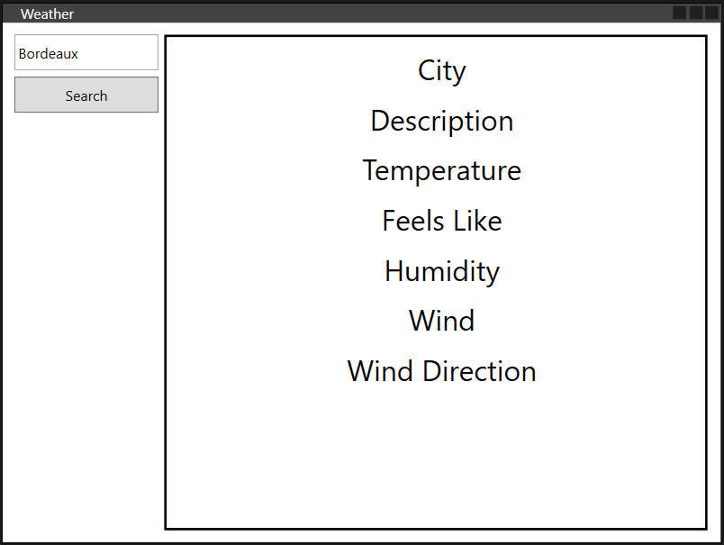

Maintenant que nous avons ajouté les contrôles à la fenêtre, nous allons voir comment les mettre à jour avec les données météo.

### Mise à jour des données

Pour mettre à jour les données météo dans les contrôles, nous allons ajouter une méthode `SetWeatherInfo` à la classe `MainWindow`. Cette méthode prend en paramètre un objet `WeatherData`, et met à jour les `TextBlock` avec les données météo.

```csharp
private void SetWeatherInfo(WeatherData weatherData)
{
    Title = $"Weather in {weatherData.City}";
    TxtCityName.Text = $"Weather in {weatherData.City}";
    TxtDescription.Text = weatherData.Description;
    TxtTemperature.Text = $"{double.Round(weatherData.Temp)}°C";
    TxtFeelsLike.Text = $"Feels like {double.Round(weatherData.FeelsLike)}°C";
    TxtHumidity.Text = $"{weatherData.Humidity}% humidity";
    TxtWind.Text = $"Wind is {weatherData.WindSpeed} m/s";
    TxtWindDirection.Text = $"{weatherData.WindDirection}°";
}
```

Cette méthode met à jour les `TextBlock` avec les données météo passées en paramètre. Elle met également à jour le titre de la fenêtre avec le nom de la ville. Les valeurs numériques sont arrondies pour plus de lisibilité.

Vous pourrez également observer le système d'interpolation de chaînes de caractères utilisé pour afficher les données météo. Ce système devrait réveiller des souvenirs si vous avez déjà utilisé des langages comme Python ou JavaScript.

Il est intéressant de créer des méthodes comme celles-ci afin d'éviter au maximum le code dans les gestionnaires d'évènements. Cela permet de rendre le code plus lisible et maintenable, et de faciliter les tests unitaires.

Après l'implémentation de cette méthode, notre gestionnaire d'évènements `BtnSearch_Click` devrait ressembler à ceci :

```csharp
private void BtnSearch_Click(object sender, RoutedEventArgs e)
{
    WeatherData weatherData;
    try
    {
         weatherData = WeatherService.GetWeather(TxtCity.Text);
    }
    catch (Exception ex)
    {
        MessageBox.Show(ex.Message, "Error", MessageBoxButton.OK, MessageBoxImage.Error);
        return;
    }
    SetWeatherInfo(weatherData);
}
```

Vous pouvez également constater l'utilisation de `MessageBox` pour afficher les erreurs. Cela permet d'informer l'utilisateur en cas d'erreur, et de lui donner des indications sur ce qui s'est mal passé.

Une fois tout cela mis en place, vous pouvez tester votre application en lançant le débogage (F5). Si votre clé API est correcte, et que la ville existe, vous devriez voir les données météo s'afficher dans les `TextBlock` après avoir cliqué sur le bouton "Search".

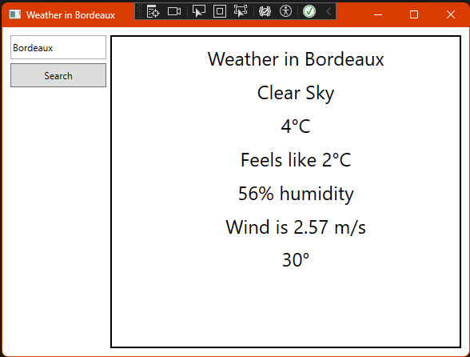

(la température fonctionne correctement, il faisait juste froid)

## Fonctionnalités supplémentaires

Maintenant que nous avons une application fonctionnelle qui affiche les données météo, nous pouvons ajouter quelques fonctionnalités supplémentaires pour améliorer l'expérience utilisateur.

### Suggestion de villes

Nous pouvons ajouter une fonctionnalité amusante dans l'espace vide sous le champ de recherche. Nous allons afficher une liste de villes du monde, et permettre à l'utilisateur de sélectionner une ville dans cette liste.

Il nous suffit simplement de pré-enregistrer une liste de villes dans le code, et de l'afficher dans un `ListBox` dans notre application.

```csharp
private readonly List<string> Cities =
[
    "London",
    "Paris",
    "Berlin",
    "New York",
    "Tokyo",
    "Moscow",
    "Beijing",
    "Cairo",
    "Sydney",
    "Rio de Janeiro"
];
```

```xml
<ListView x:Name="CitiesListView"
  ItemsSource="{Binding Cities}"
  SelectionChanged="CitiesListView_SelectionChanged"
  Margin="10,80,470,10">

    <ListView.View>
        <GridView>
            <GridViewColumn Header="City" DisplayMemberBinding="{Binding}" />
        </GridView>
    </ListView.View>
</ListView>
```

Nous pouvons ensuite ajouter l'assignement des villes dans le constructeur de la classe `MainWindow` :

```csharp
CitiesListView.ItemsSource = Cities;
```

Et enfin, nous pouvons ajouter un gestionnaire d'évènements pour mettre à jour la `TextBox` avec la ville sélectionnée :

```csharp
private void CitiesListView_SelectionChanged(object sender, SelectionChangedEventArgs e)
{
    if (CitiesListView.SelectedItem is string city)
    {
        TxtCity.Text = city;
        WeatherInfoQuery(city);
    }
}
```

Vous l'aurez compris, une nouvelle méthode `WeatherInfoQuery` est utilisée pour mettre à jour les données météo en fonction de la ville sélectionnée.
Cela permet de limiter au maximum la réutilisation du code, et de rendre l'application plus robuste. Nous pouvons aussi réecrire l'event handler `BtnSearch_Click` pour appeler cette nouvelle méthode.

```csharp
private void BtnSearch_Click(object sender, RoutedEventArgs e)
{
    WeatherInfoQuery(TxtCity.Text);
}
```

Une fois ces fonctionnalités ajoutées, vous devriez voir la liste des villes s'afficher sous le champ de recherche. Vous pouvez sélectionner une ville dans la liste, et les données météo de cette ville devraient s'afficher dans les `TextBlock`.

Notre application fonctionne correctement, mais il reste une dernière étape à franchir : le déploiement.

## Déploiement de l'application

Pour déployer une application Windows, vous pouvez utiliser l'outil de publication fourni par Visual Studio. Cet outil vous permet de créer un package d'installation pour votre application, que vous pouvez ensuite distribuer à vos utilisateurs.

Pour publier votre application, vous pouvez vous rendre dans le menu Build, et sélectionner "Publish".

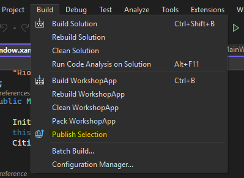

Vous serez alors guidé à travers un assistant qui vous permettra de configurer le package d'installation. Vous pourrez choisir le type de package, le répertoire de sortie, les options de publication, etc.

Dans notre cas, nous ne disposons pas de machine Azure prête à recevoir notre application, donc nous allons simplement publier notre application en local.

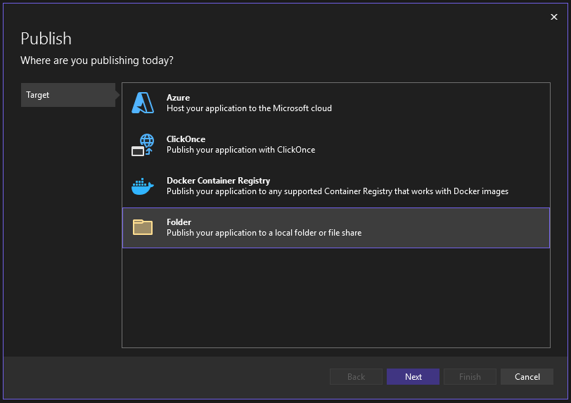

> Next Next Next Finish

Vous allez ensuite pouvoir cliquer sur le magnifique bouton violet situé en haut de la fenêtre, et si tout se passe bien votre application est désormais publiée !

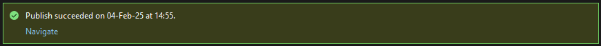

L'application se trouve désormais dans le répertoire de sortie que vous avez spécifié (par défaut dans `$project/bin/Release/net8.0-windows/publish`), et vous pouvez la distribuer à vos utilisateurs.

## Conclusion

Félicitations, vous avez développé une application Windows en C# qui affiche les données météo d'une ville ! Vous avez appris comment créer une application Windows avec Visual Studio, ajouter des contrôles, gérer des événements, appeler une API, afficher des données, et déployer l'application.

Comme vous pouvez sûrement vous en douter, ce workshop n'est qu'une introduction au développement d'applications Windows en C#. Il existe d'innombrables possibilités de développement avec ce framework, que je vous invite à explorer si l'envie vous prend !
